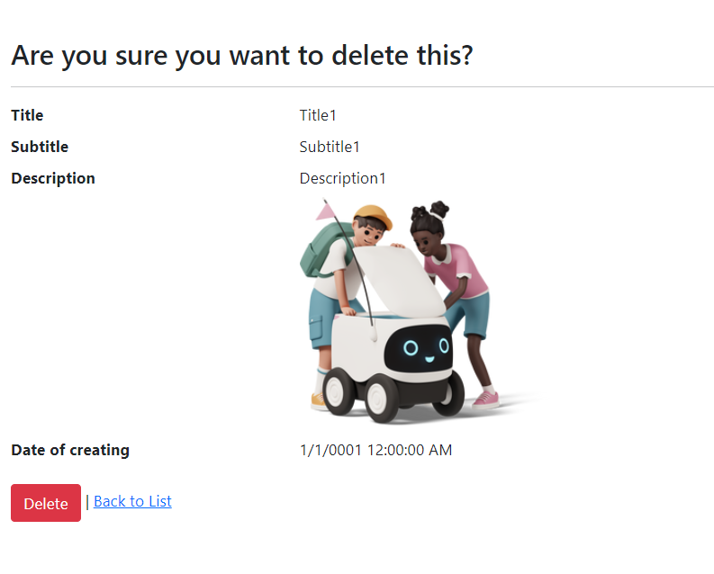

# Get started

- The main page - page with last 5 news. If your database is empty, 5 news are created automatically.

- If your want to see all news, click "see more" or "all news" top left.

- If your want to see information about one definition new - click "Details" .

- Your can change language at the top left.

- At the top left also you can go to the login page. To enter as admin : Email:admin@mail.ru, Password: 123456.

- After enter your can see page with admin functions(create on top, delete and edit).

- Create with checking the fullness of the fields

- If you decide to delete a new, you need to confirm your action.

